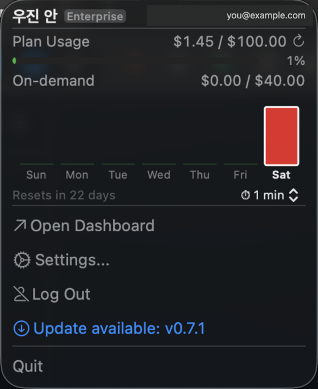
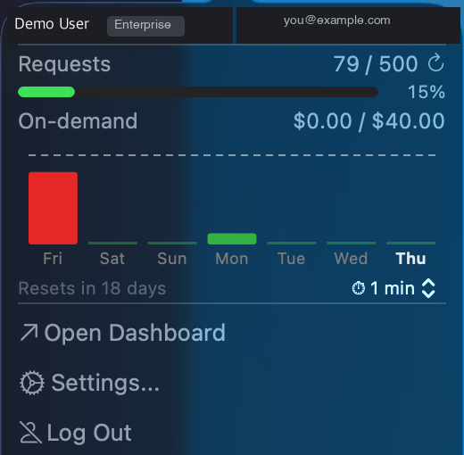
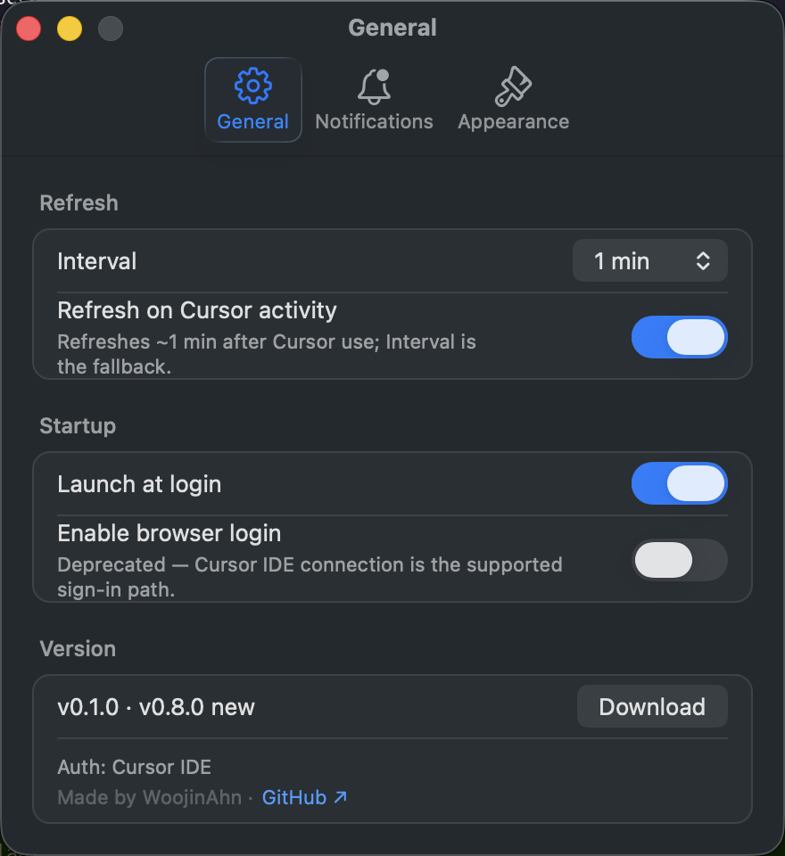

**English** | [한국어](README.ko.md)

<p align="center">
  
</p>

<h1 align="center">CursorMeter</h1>

<p align="center">
  
  
  
  
</p>

A lightweight macOS menu bar app for monitoring [Cursor](https://www.cursor.com/) IDE usage at a glance — no browser tab needed.

Unlike in-editor extensions, CursorMeter runs independently as a native macOS app: always visible in the menu bar whether the IDE is open or not, with persistent login via Keychain across restarts.

## Features

- Gauge ring icon in menu bar with color thresholds (green → yellow → red)
- View billing usage, per-model request counts, and reset date from the menu bar
- macOS notifications when usage reaches customizable thresholds (default: 65%/90%)
- **Usage-jump effect** — menu bar icon flashes ⚡ on a moderate jump and 🚀 on a Max-mode-sized jump, so a sudden spike is hard to miss. Three intensity levels (Quiet / Normal / Bold); Bold also raises a macOS notification on tier-2 jumps.
- **Weekly usage chart** (enterprise team accounts) — rolling 7-day bar graph in the popover with adaptive y-axis, dashed daily-budget reference line, hover tooltip, and a configurable today-highlight (Outline / Dim others / Both).
- Menu bar display mode toggle: fraction (used/limit) or percentage (%)
- Settings UI (refresh interval, notification thresholds, menu bar display format, jump-effect intensity, weekly-chart style)
- Launch at login support
- In-app update checker
- In-app WebView login (Google, GitHub, Enterprise SSO)
- Auto-refresh at configurable intervals (1/2/5/15 min)
- Keychain-based credential storage
- Pure AppKit — light memory footprint (~13 MB idle, ~30 MB once the popover has been opened; macOS retains AppKit / popover state for instant re-opens). If you don't need the weekly chart and want the older ~15 MB footprint instead, [v0.2.1](https://github.com/WoojinAhn/CursorMeter/releases/tag/v0.2.1) is the previous stable release.

## Security

- Zero external dependencies (macOS SDK only)
- Two-tier WebView host whitelist (exact + suffix), with `https`-scheme enforcement on both navigation action and response
- Required-cookie validation before persisting a login session
- Host-validated `NSWorkspace.open` for any URL derived from the GitHub Releases API
- `URLSessionConfiguration.ephemeral` (no disk cache)
- Keychain-based credential storage

See [`SECURITY.md`](SECURITY.md) for the full threat model and reporting policy.

## Requirements

- macOS 14 (Sonoma) or later

## Installation

1. Download the latest `.zip` from [Releases](https://github.com/WoojinAhn/CursorMeter/releases)
2. Unzip and drag `CursorMeter.app` to `/Applications`
3. On first launch, macOS may block the app (unsigned). To bypass:
   - **Right-click** the app → **Open** → click **Open** in the dialog
   - Or: System Settings → Privacy & Security → click **Open Anyway**

## Build from Source

```bash
# Build + create .app bundle (ad-hoc signed)
bash Scripts/package_app.sh

# Install
cp -r CursorMeter.app /Applications/
```

Requires Swift 6.0+ and Xcode.

## Testing

```bash
swift test    # Run all tests (requires Xcode)
```

Unit tests (LogRedactor, UsageDisplayData, DomainWhitelist, CircularProgressIcon, NotificationManager) + Integration tests (CursorAPIClient with URLProtocol mock). See [test-checklist.md](docs/test-checklist.md) for manual test scenarios.

## Disclaimer

This app uses Cursor's **undocumented internal APIs** (`/api/usage`, `/api/usage-summary`, `/api/auth/me`). These endpoints may change or be blocked at any time without notice.

## Roadmap

- [ ] Switch progress display to on-demand when request quota exhausted ([#36](https://github.com/WoojinAhn/CursorMeter/issues/36))

## Contributing

Found a bug or have an idea? [Open an issue](https://github.com/WoojinAhn/CursorMeter/issues) — feedback and suggestions are always welcome. Pull requests are not accepted at this time.

## Screenshots

<table>
  <tr>
    <th align="center">Menu bar</th>
    <th align="center">Popover</th>
    <th align="center">Weekly chart (Enterprise)</th>
    <th align="center">Settings</th>
  </tr>
  <tr>
    <td align="center" valign="top"></td>
    <td align="center" valign="top"></td>
    <td align="center" valign="top"></td>
    <td align="center" valign="top"></td>
  </tr>
</table>

## License

MIT
